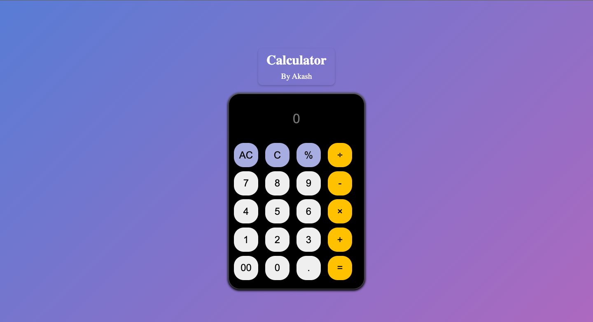

# Simple_Calculator
# Calculator By Akash

A simple calculator web application

## Table of Contents
- [Features](#features)
- [Demo](#demo)
- [Prerequisites](#prerequisites)
- [Usage](#usage)
- [Contributing](#contributing)
- [Connect with Us](#connectwithus)

## Features

- Basic arithmetic operations (addition, subtraction, multiplication, division).
- Percentage calculation.
- Clear entry and all-clear functionalities.
- Responsive design for different screen sizes.

## Demo

You can try the calculator live at [Demo Link](https://akashrana18.github.io/Simple_Calculator/).

### Prerequisites

You need a modern web browser to run this application.

### Installation

You don't need to install anything to use this calculator. Just open the [Demo Link](https://akashrana18.github.io/Simple_Calculator/) in your web browser, and you're ready to go.

## Usage

1. Enter numbers and operators by clicking the buttons.
2. Click the "=" button to calculate the result.
3. Click "C" to clear the last entry.
4. Click "AC" to clear the entire input.
5. The calculator is responsive and adjusts to different screen sizes.

## Contributing

Contributions are welcome! If you'd like to contribute to this project, please follow these steps:

1. Fork the repository.
2. Create a new branch for your feature or bug fix.
3. Make your changes and commit them with descriptive messages.
4. Push your branch to your forked repository.
5. Create a pull request to the main repository.

Feel free to customize this template further to suit your project's specific details and requirements.

## Connect with Us

- [Twitter](https://twitter.com/Akash08_18)
- [LinkedIn](https://www.linkedin.com/in/akashrana18)
- [Instagram](https://www.instagram.com/codewithakash/)

